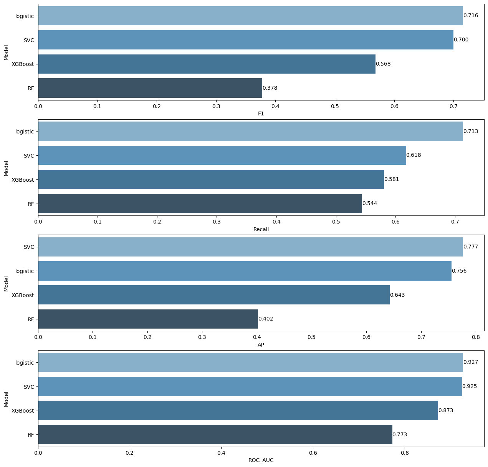

# Soldiers-Race-Classification 

The 2012 US Army Anthropometric Survey (ANSUR II) was executed by the Natick Soldier Research, Development and Engineering Center (NSRDEC) from October 2010 to April 2012 and is comprised of personnel representing the total US Army force to include the US Army Active Duty, Reserves, and National Guard. In addition to the anthropometric and demographic data described below, the ANSUR II database also consists of 3D whole body, foot, and head scans of Soldier participants. These 3D data are not publicly available out of respect for the privacy of ANSUR II participants. The data from this survey are used for a wide range of equipment design, sizing, and tariffing applications within the military and has many potential commercial, industrial, and academic applications.

The ANSUR II working databases contain 93 anthropometric measurements which were directly measured, and 15 demographic/administrative variables explained below. The ANSUR II Male working database contains a total sample of 4,082 subjects. The ANSUR II Female working database contains a total sample of 1,986 subjects.

DATA DICT:
https://data.world/datamil/ansur-ii-data-dictionary/workspace/file?filename=ANSUR+II+Databases+Overview.pdf

---

## Tasks:⚙️
#### 1. Exploratory Data Analysis (EDA)
- Import Libraries, Load Dataset, Exploring Data

    *i. Imported Libraries*
    
    *ii. Ingested Data *
    
    *iii. Explored Data*
    
    *iv. Outlier Detection*
    
    *v.  Dropped unnecessary features*

#### 2. Data Preprocessing
- Scale (if needed)
- Separeted the data frame for evaluation purposes

#### 3. Multi-class Classification
- Imported libraries
- Implemented SVM Classifer
- Implemented Decision Tree Classifier
- Implemented Random Forest Classifer
- Implemented XGBoost Classifer
- Compared The Models
- Enhance the scores with SMOTE
- Use SHAP to explain how the best model

## Used Libraries 📚
- `numpy`- `pandas`- `matplotlib`- `seaborn` - `sklearn`- `scikitplot` - `xgboost` - `imblearn`- `shap`

## Run the project ⚙️
The repository includes a Jupyter notebook which you can run on your local machine or use this  link.

## Results 🪄

The above image demonstrates that the tuned logistic regression model got good scores outperforming the other 3 tuned models (SVM, Random Forest, XGBoost).

Optimal Hyperparameters for Logistic Regression:

| Parameter    | Value   |
| :---: | :---: |
| C   | `1`   |
| class_weight   | `'balanced'` |
| max_iter   | `1000` |
| solver   | `'liblinear'` |
| penalty   | `'l1'` |
| random_state   | `101` |
| max_iter   | `50000` |

## Acknowledgements
This project is part of ML bootcamp provided by <a href="https://clarusway.com/"> Clarusway</a>.

